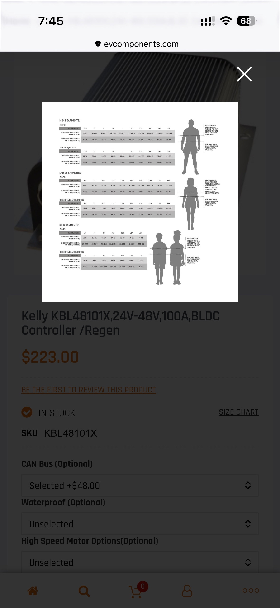
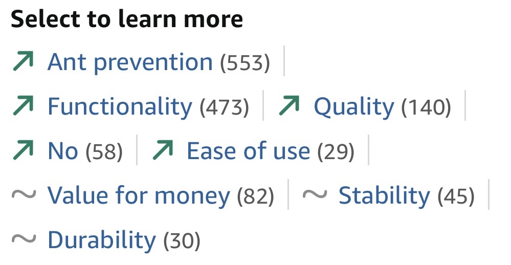

On common math websites, Firefox asks me if I want to translate the page from Greek to English

---

Click the `Run Client` gradle task, and watch as IDEA's markdown previewer starts randomly scrolling up and down out of control in the background.

---

All I wanted to know is what the size of the motor controller was, and instead I got this "Size Chart".

---

Apparently, "No" is a trending feature for this product on Amazon's website.

